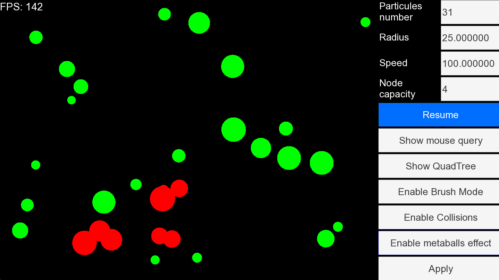
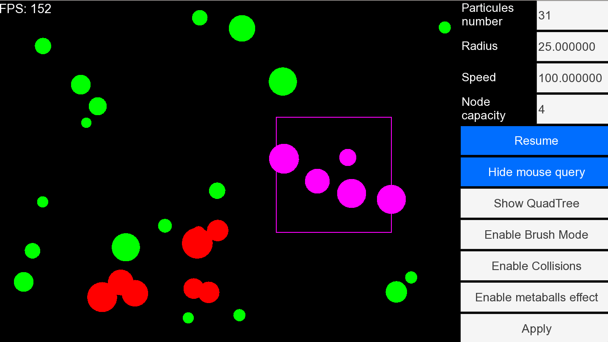
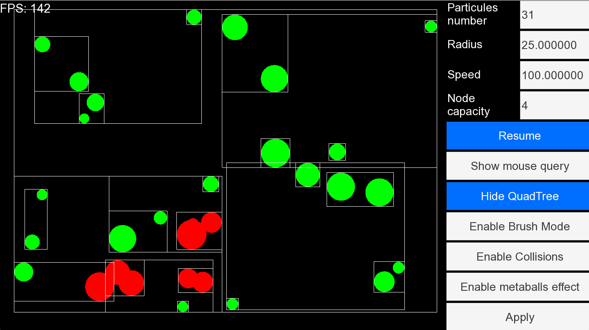
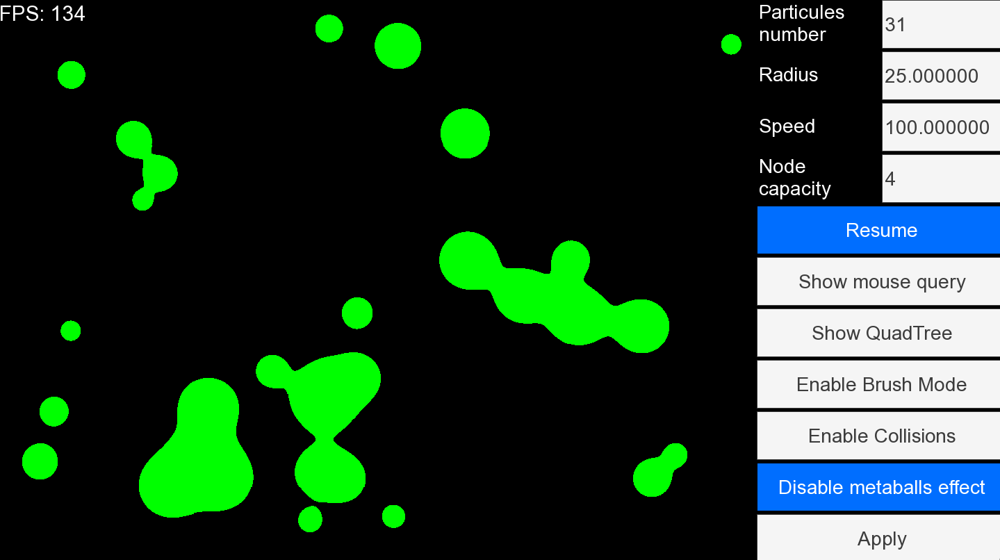

# My Metaballs project

using :
- CMake to build project
- Loose quadtree for collision detection
- glsl for metaballs effet
- SFML library for drawing and inputs
- TGUI for widgets

### to install dependencies on linux:
$sudo apt update

$sudo apt install \\
    libxrandr-dev \\
    libxcursor-dev \\
    libudev-dev \\
    libfreetype-dev \\
    libopenal-dev \\
    libflac-dev \\
    libvorbis-dev \\
    libgl1-mesa-dev \\
    libegl1-mesa-dev
